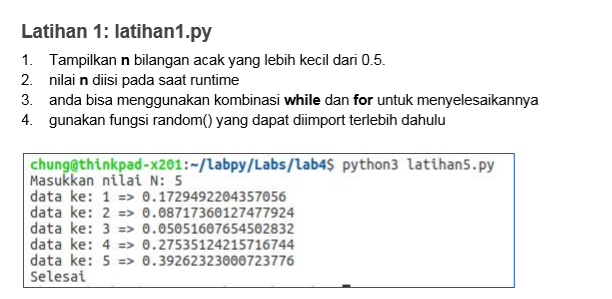
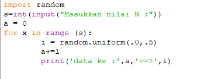
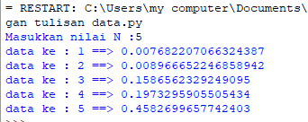
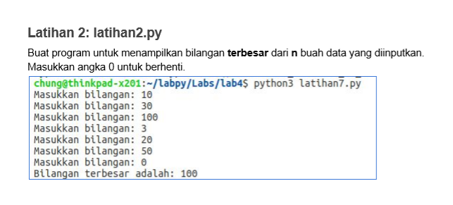
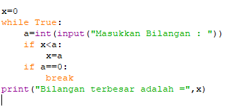
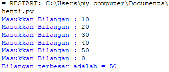
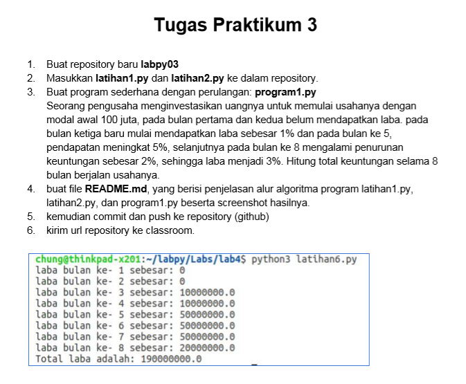
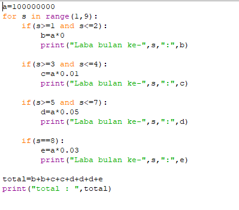
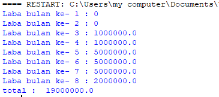

# Tugas Pertemuan 7 - Praktikum 3

Nama : Bangkit Akbar Anggara

NIM : 312010148

Kelas : TI.20.B.1

# Tugas Latihan 1 - Praktikum 3

Selain tugas praktikum 2 pada pertemuan 7 saya di beri tugas ke-3, yaitu :

Daftar Isi 

| No | Description | Link
| --- | ---- | ----
| 1 | Tugas 1 | [Click Here](#Tugas-1)
| 2 | Tugas 2 | [Click Here](#Tugas-2)
| 3 | Tugas 3 | [Click Here](#Tugas-3)

# Tugas 1
Berikut ini adalah tugas 1 -praktikum 3:

Saya menggunakan syntax berikut untuk menjawab soal dari tugas 1 - praktikum 3

Keterangan:
 - Saya menggunakan s=int(input('')) untuk menginputkan angka yang ingin kalian masukkan
 - Lalu a=0 itu adalah angka untuk memunculkan data ke berapa
 - Saya menggunakan for x in range(s) untuk mengembalikan deret atau data yang diinputkan di integer
 - Saya menggunakan random.uniform untuk mencari nilai yang lebih kecil dari 0,5
 - Untuk a+=1 itu saya gunakan agar angka yang muncul dari tulisan datanya berbeda - beda
 
Maka hasil run dari syntax di atas adalah

Sudah?Lanjut ke tugas yang ke-2

# Tugas 2

Disini kita akan mengerjakan tugas ke-2 dari praktikum yang sama yaitu praktikum 3:

Untuk mengerjakan tugas latihan 2 ini saya menggunakan syntax seperti di bawah ini

Keterangan:
 - Saya menggunakan while untuk sistem perulangannya
 - Lalu saya menggunakan integer karena yang akan kita inputkan nanti berupa angka
 - Lalu saya menggunakan if untuk mengeksekusi jika kondisi bernila benar True
 - Lalu break di gunakan untuk menghentikan jalannya proses iterasi  pada statement whilenya
 - Statement di bawah break tidak akan di eksekusi dan program akan keluar dari proses looping

Maka ketika kita run syntax tersebut akan muncul seperti di bawah ini

Sudah bisa?Jika sudah kita lanjut ke tugas yang ke-3

# Tugas 3

Oke di tugas kali ini yang ke-3 kita akan mengerjakan soal ke 3 dari praktikum 3 di bawah ini adalah soalnya

Berikut adalah syntax yang saya gunakan

Keterangan:
 - Saya mengetikkan a=100000000 itu karena di soal kita disuruh menghitung laba dengan modal yang di berikan yaitu Rp.100.000.000
 - Lalu range seperti biasa sebagai counter pada perulangan for
 - Lalu if s>=1(dari bulan 1 ke atas) and s<=2(dari bulan 2 ke bawah) itu cara yang saya gunakan untuk menghitung dari bulan 1 ke atas tapi tidak sampai lebih dari bulan ke 2
 - Lalu b=a*0 alasannya itu karena b akan kita gunakan untuk menghitung total banyaknya laba dari semua bulan yang kita hitung nanti.
 - Sementara a*0 itu karena pada bulan pertama sampai bulan kedua mereka tidak mendapatkan hasil laba
 - Lalu alasan saya menghitung bulan ke delapan menggunakan laba yang 3% itu karena ini di kalikan sementara 2% itu adalah kerugian jadi itulah alasan mengapa saya menggunakan yang 3% bukan 2% 
 - Lalu dengan memasukan + pada huruf b sampai e untuk menghitung total semua laba yang di dapat oleh pengusaha
 
Maka jika kita run hasil dari syntax di atas adalah sebagai berikut

Kenapa hasilnya tidak sesuai modul??

Itu karena pada bulan kedelapan saya mengkalikannya denga laba yang 3%, jika ingin hasilnya sama dengan yang di modul maka kalian tulis seperti ini
      
      if(s==8):
        e=a*0.02
        print("Laba bulan ke-",s,":",e)

Maka hasil run akan sama seperti di modul seperti contoh gambar di bawah ini

Dengan begini selesai sudah tugas pemrograman pertemuan 7 ini sekian terimakasih

# ===Bangkit Akbar Anggara===
# ===Arigatou Gozaimasu===
